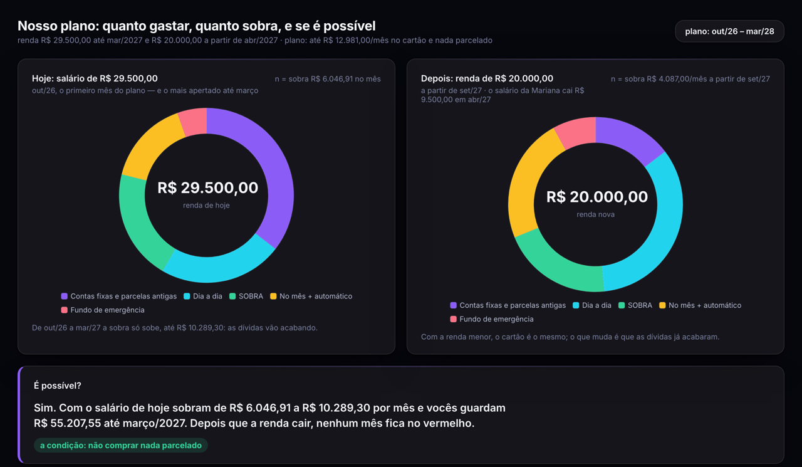
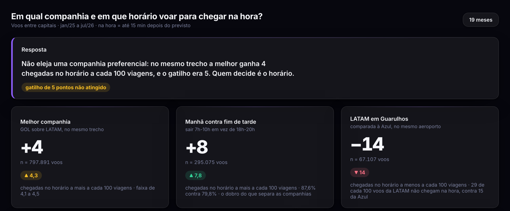

### Olá, sou o Leonardo 👋

Transformo os dados que uma empresa (ou uma família) já tem em **decisão**: começo pela pergunta de negócio, trato e confiro os dados, e entrego a resposta num painel que se lê em uma tela.

Também construo produto: sou sócio e desenvolvedor do **[RevelaCash](https://revelacash.com.br)**, controle financeiro da família pelo WhatsApp.

**Como eu trabalho**
- 🎯 Pergunta primeiro: o que vai ser decidido com a resposta, e qual número muda essa decisão.
- 🔍 Dado conferido antes de analisado: grafias diferentes da mesma coisa, registros duplicados, valores fora do lugar.
- 🧪 Conclusão testada: base pequena, período incompleto e explicação alternativa, antes de virar recomendação.
- ✅ Checagem automática: nenhum número do texto pode divergir do cálculo.
- 📊 Entrega que se usa: painel interativo, relatório sem código e o notebook completo.

---

### 📂 Projetos

**[RevelaCash](https://revelacash.com.br)** · *produto em produção · sócio e desenvolvedor*  
Controle financeiro da família em que o lançamento acontece pelo WhatsApp: a pessoa manda "gastei 84,90 no mercado" — por texto, áudio ou foto do cupom — e a assistente Nina lança o gasto já categorizado. O painel web mostra para onde vai o dinheiro e fecha o mês. Assinatura mensal, com famílias pagantes.  
**Stack:** React + Vite (Vercel) · Node.js/Express em Cloud Functions · Firestore · Firebase Auth · Gemini · WhatsApp Cloud API · cerca de 1.700 testes automatizados.  
*Código-fonte privado.*  
[🌐 revelacash.com.br](https://revelacash.com.br)

**[Diagnóstico e plano financeiro de uma família](https://github.com/leonardo-informacao/analise-financas-familiares)**  
Renda alta, e no fim do mês sobravam R$ 239. A partir de 20 faturas de cartão, a análise mostra para onde ia o dinheiro e monta um plano que junta R$ 55 mil em seis meses — sem nenhum mês negativo, mesmo com uma queda de renda prevista. *Nomes alterados para preservar a privacidade.*  
[📊 Painel](https://leonardo-informacao.github.io/analise-financas-familiares/relatorios/painel_nosso_plano_quanto_gastar_quanto_sobra_e_se_e_possivel.html) · [📄 Relatório](https://leonardo-informacao.github.io/analise-financas-familiares/relatorios/analise.html)

**[Pontualidade dos voos entre capitais](https://github.com/leonardo-informacao/pontualidade-voos-brasil)**  
Em qual companhia e em que horário viajar para chegar na hora? Análise dos dados públicos de voos do Brasil.  
[📊 Painel](https://leonardo-informacao.github.io/pontualidade-voos-brasil/relatorios/painel_pontualidade.html) · [📄 Relatório](https://leonardo-informacao.github.io/pontualidade-voos-brasil/relatorios/analise.html)

---

### 🛠️ Ferramentas
**Dados:** Python · pandas · Jupyter · DuckDB · Matplotlib · ECharts  
**Produto:** React · Node.js · Firebase · Vercel · Gemini · Git

### 📫 Contato
[LinkedIn](https://www.linkedin.com/in/eusouleonardocardosodev)
